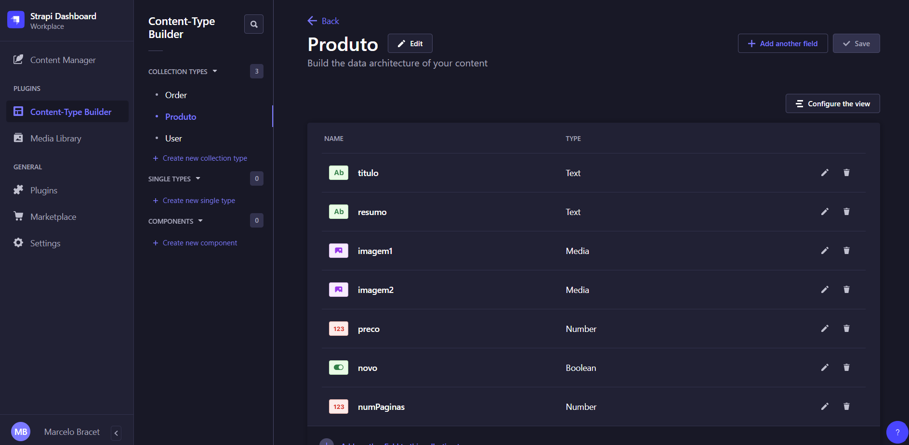

## Livros Seminovos - Projeto

> Projeto **em desenvolvimento**

Nele foram usadas diversas tecnologias e bibliotecas, são elas:

**Strapi**

> CMS utilizado para que o cliente consiga adicionar, deletar ou modificar dados do site sem que tenha que mexer diretamente no código.

**Stripe**

> Biblioteca utilizada para facilitar durante a finalização de compra até efetuar o pagamento pelo livro.

**Sass**

> Utilizado para facilitar na estilização do site, conseguindo deixar tudo preparado antecipadamente, sendo necessários somente o cliente adicionar os dados, pois a parte da estilização já estará toda preparada com sua ajuda.

Obtive **2 dificuldades** durante o desenvolvimento dessa aplicação, seguem elas:

- Integração com o Stripe ( Obtive erros devido a lógica usada durante a implementação do Strapi ).
- Nunca tinha utilizado o Strapi anteriormente, então no começo da aplicação tive algumas dificuldades quanto a utilização, porém com algumas pesquisadas conseguir resolver sem problemas.

Seguem algumas imagens do projeto para que possam dar uma olhada

**É bom deixar claro que as imagens ainda estão mockadas para que o cliente consiga alterar tudo dentro do próprio strapi**

> Quando somente um item está sendo adicionado ao carrinho
> 
> 

> Quando mais de um item está adicionado ao carrinho
> 

> CMS (strapi)
> 
